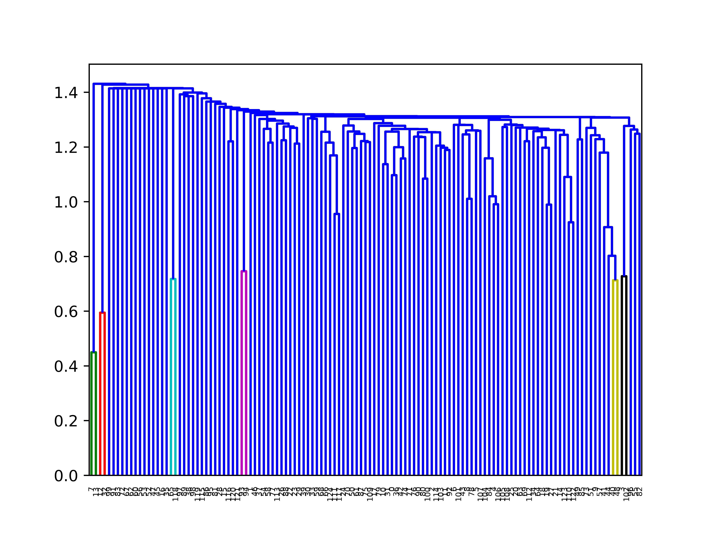

# News-Aggregator
Python script to fetch important news by aggregating news from various sources
    
THe .py file fetches news from certain rss feeds.   
The data  obtained is stored in different documents as per sources.   
Then their term frequency- inverse document frequency is calculated for each of the term to form the key wordslist that will define the particular news.  
These are in turn used to form the feature vectors that are used for hierarchical clustering. This clustering helps to arrange news as per its frequency.   
Hence we choose a suitable level in the dendogram to chop the tree and get the relevant news only.   
   

